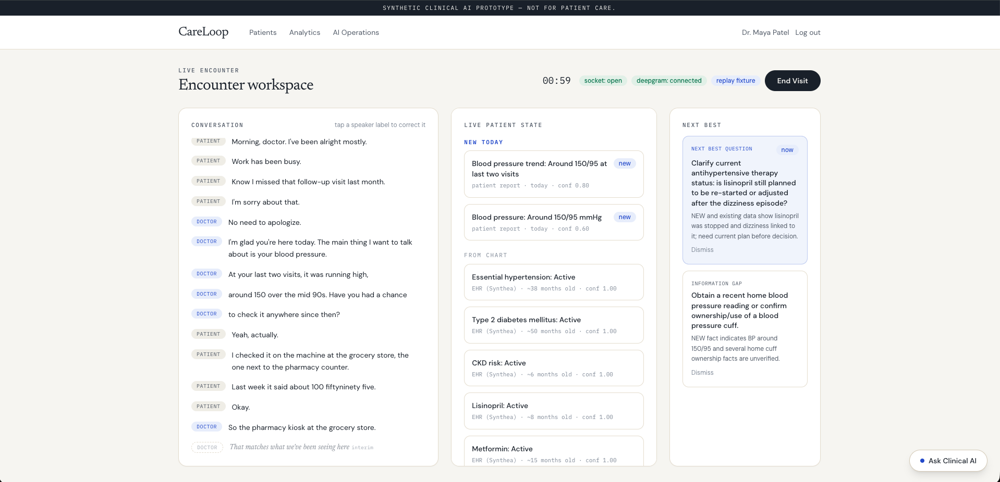
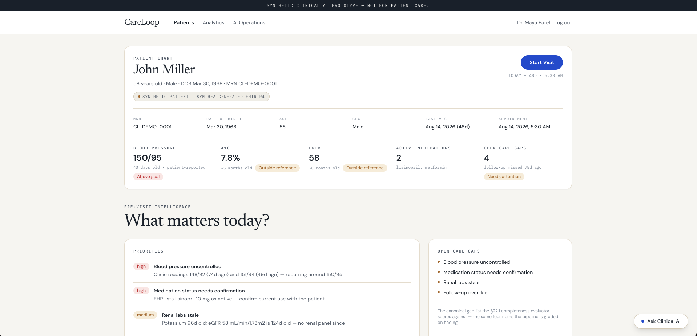
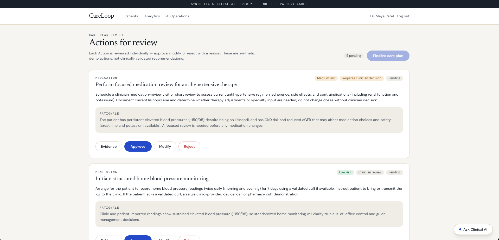
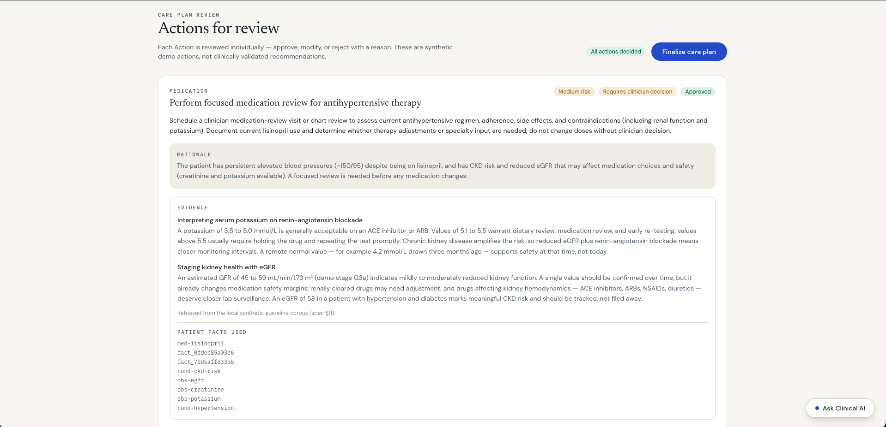
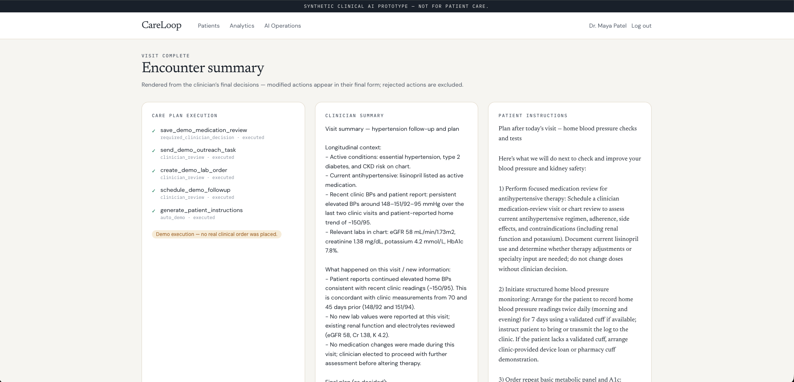
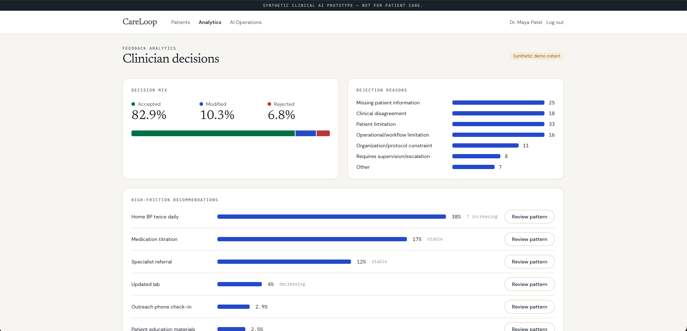
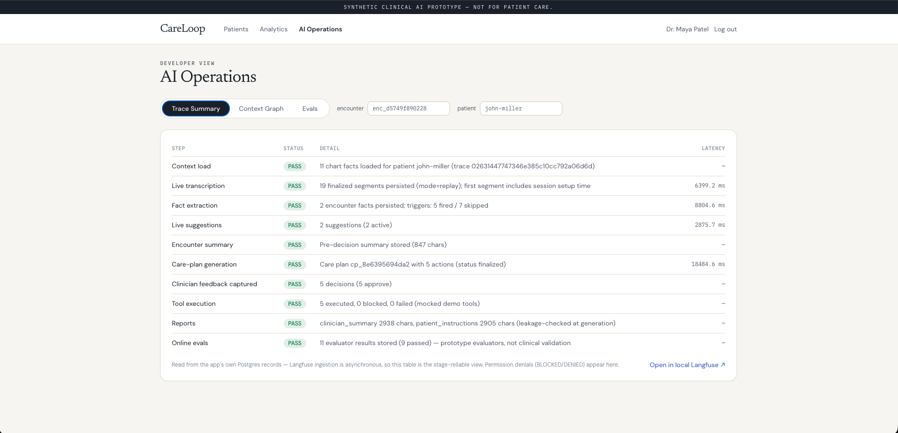
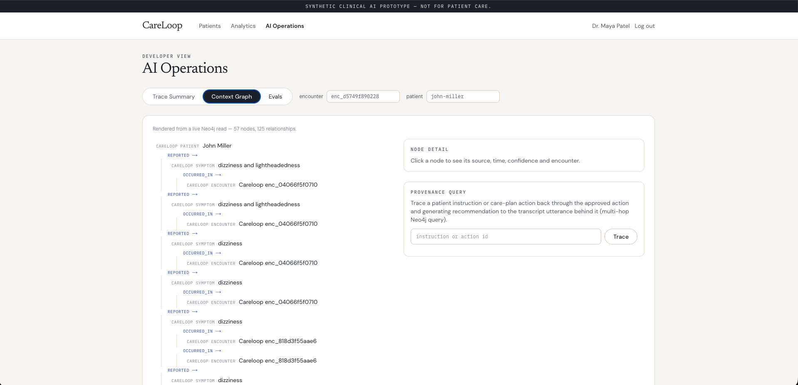
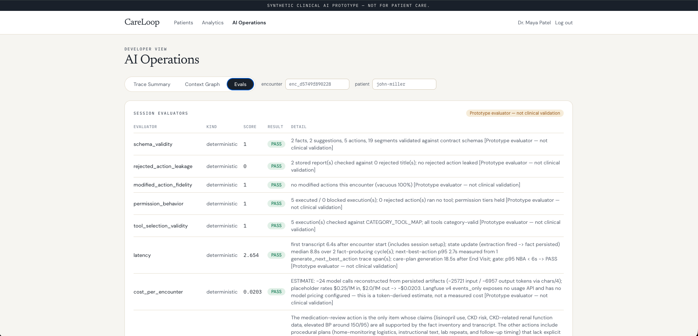

# CareLoop

**Synthetic clinical AI prototype — not for patient care.**

CareLoop demonstrates a clinician-reviewed workflow from an encounter to a structured care plan. Built as an interview project, it brings together voice transcription, longitudinal patient context, AI-generated suggestions, explicit clinician decisions, and evaluation of model output.

All bundled patient records are synthetic. The replay recording uses synthetic voices. Do not enter real patient information or use generated output to make clinical decisions.

## Product screenshots

Actual screenshots supplied from the running local demo. All patient records and cohort analytics are synthetic. These are prototype outputs, not validated clinical recommendations; the displayed trace reports 9 of 11 evaluators passed.

**Live encounter — transcription, extracted facts, and next-best questions**



<details>
<summary>Explore the chart, care plan, summaries, and evaluation views</summary>

**Patient context and pre-visit priorities**



**Per-action approval, modification, and rejection controls**



**Retrieved synthetic evidence and patient-fact references**



**Final encounter summary and demo tool execution**



**Synthetic cohort decision mix and rejection reasons**



**Recorded pipeline stages and evaluation status**



**Neo4j context and provenance exploration**



**Evaluator scores, timing, and estimated model cost**



</details>

## Explore the demo

1. Sign in with the demo credentials supplied by the project owner.
2. Open a synthetic patient chart and review its longitudinal context.
3. Start an encounter using the bundled audio replay or microphone input.
4. Review the generated summary and proposed care-plan actions.
5. Approve, modify, or reject actions; inspect the resulting demo workflow and evaluation views.

Replay uses the real transcription service; it is not an offline prerecorded transcript. Voice and AI features require configured external services. Workflow tools are demonstrations, not connections to a clinical system.

**Source code:** [github.com/ranjan-py/careloop](https://github.com/ranjan-py/careloop). There is currently no hosted demo; run the project locally using the instructions below.

## Implemented components

- **Voice encounters:** microphone capture, WebSocket streaming, replay audio, and Deepgram transcription.
- **Clinical context:** synthetic FHIR R4 records, PostgreSQL as the application record, and a Neo4j context projection.
- **AI assistance:** OpenAI-backed extraction, suggestions, summaries, and structured care-plan generation.
- **Clinician review:** action approval, modification, rejection, and permission checks before demo execution.
- **Evaluation:** offline evaluation cases, online evaluation and analytics, and Langfuse trace integration.

See [architecture](docs/architecture.md), [API contracts](contracts/CONTRACTS.md), and the [demo walkthrough](docs/demo-script.md). [VERIFICATION.md](VERIFICATION.md) records earlier local verification runs; it is not evidence that a hosted deployment is currently healthy.

## Run locally

Requirements: Docker Desktop with Docker Compose and enough memory for the full database and observability stack (the existing stack recommends 12–16 GB).

```sh
cp .env.example .env
# Edit .env locally: supply your OpenAI and Deepgram keys.
# Never commit .env or paste its contents into logs.
docker compose up --build -d
make seed
```

| Service | Local address |
| --- | --- |
| Application | http://localhost:3002 |
| Backend | http://localhost:8002 |
| Langfuse | http://localhost:3101 |
| Neo4j browser | http://localhost:7474 |

Use the `DEMO_USER_EMAIL` and `DEMO_USER_PASSWORD` values from your local `.env` to sign in. Use Chrome over HTTPS or localhost for microphone access. Seeding populates the synthetic demo data. `make reset-demo` deletes the Compose volumes; do not run it against work you need to retain.

## Configuration

`.env.example` documents the settings with local placeholders. External deployments need unique credentials and HTTPS; the local example passwords are not suitable for public hosting.

| Settings | Purpose |
| --- | --- |
| `OPENAI_API_KEY`, `OPENAI_MODEL`, `OPENAI_GENERATION_MODEL`, `OPENAI_EVAL_MODEL` | AI inference and evaluation |
| `DEEPGRAM_API_KEY`, `DEEPGRAM_MODEL` | Transcription |
| `APP_DATABASE_URL` | PostgreSQL connection using `postgresql+asyncpg://` |
| `NEO4J_URI`, `NEO4J_USER`, `NEO4J_PASSWORD` | Context graph |
| `LANGFUSE_HOST`, `LANGFUSE_PUBLIC_KEY`, `LANGFUSE_SECRET_KEY` | Observability |
| `APP_SECRET`, `DEMO_USER_EMAIL`, `DEMO_USER_PASSWORD` | Demo session signing and access |
| `APP_ENV`, `FRONTEND_URL`, `BACKEND_URL`, `NEXT_PUBLIC_WS_BASE` | Environment and routing |

AI and transcription services may incur usage charges.

## Understanding the dashboard

The evaluator dashboard separates schema/permission/report checks from model-judged grounding, completeness, and suggestion quality. Latency includes its measurement source; cost is a token-derived estimate, not a bill. Feedback analytics combine synthetic cohort data with stored decisions. [Read the metric definitions and limitations](docs/metrics-guide.md).

## Checks

```sh
cd backend
python -m venv .venv
.venv/bin/pip install -r requirements.txt
.venv/bin/python -m pytest -q
cd ../frontend
npm ci
npm run build
```

The frontend build downloads Google Fonts. Full integration checks require the running databases and authorized provider credentials. The `scripts/verify_*.py` scripts and `make smoke` exercise live integrations; some consume paid API usage.

## Limits

This is a single-demo-clinician prototype, not a production healthcare product. It has no claim of clinical validation, regulatory compliance, or safe handling of patient data. AI output can be incomplete or incorrect. The evaluator dashboard is evidence for inspecting this prototype, not a clinical safety guarantee.
